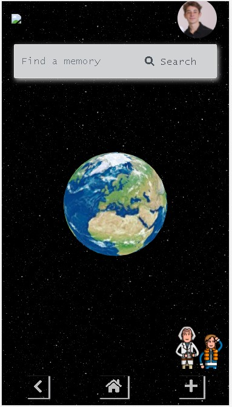
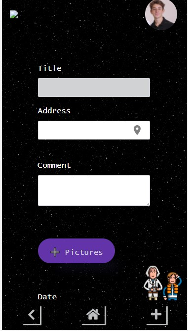

<h1 align="center">
   Souvenir app
</h1>

  

# 👨‍💻 About

This was the final project presented on the [Demo Day](https://youtu.be/Gsaq3tMb18o?t=771) at [Le Wagon coding bootcamp](https://www.lewagon.com) 🔔! 
 
> *"Projects Phase is the ultimate experience of Le Wagon 9-weeks coding bootcamp: invent, pitch, design, code and deploy an original project in teams of 3 or 4 people during the two final weeks. On the last day of the bootcamp, our Wagoners will present their products at our hugely popular **Demo Day**!" (Le Wagon)*
  

  

Made from scratch. A mobile-first app. Designed, implemented, and shipped to production, coded in Ruby on Rails.
Our web app is a simple way to organize and remember experiences in life. It allows the user to keep memories stored in a safe and easy way to access, since they can navigate through time and space to find one.

## 📚 Contents

- [Get started](#-get-started)
- [Usage and examples](#-usage-and-examples)
- [Built using](#-built-using)
- [Credits](#-credits)

## 🚀 Get started

you can access the app on: [souvenir-app-lw.herokuapp.com/](https://souvenir-app-lw.herokuapp.com/) 🚙.  
you can watch the demo of the product on: [Demo Day](https://youtu.be/Gsaq3tMb18o?t=771) 

## ✍️ Usage and examples

After the login, you can count on Dr. Brown's avatar at the bottom right to help you navigate through the app. Clicking on the plus button redirects you to another page where it is possible to add a new memory, with location and pictures. 

  

On the home page, you will find a search bar where is possible to input a location or a specific date to be searched. It will list all the results associated with that.

  

The map on the right side shows all options pinned on their actual locations. 
Finally, after you choose a car and click on it, you will be redirected to the booking page to fill in a form with some information about your rent.

## ⚙️ Built using

- HTML;
- CSS;
- JavaScript;
- Cloudinary;
- Mapbox;
- Ruby on Rails;

## ⚠️ Credits

This project is part of the content of the [Le Wagon coding bootcamp](https://www.lewagon.com) 🔔!  
A Rails app generated with [lewagon/rails-templates](https://github.com/lewagon/rails-templates).
